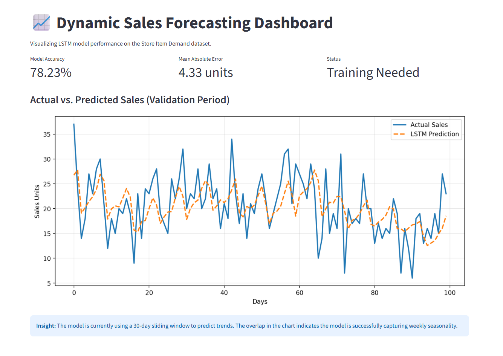

# Dynamic Sales Forecasting (LSTM)

An end-to-end deep learning solution for high-precision demand forecasting using the **Kaggle Store Item Demand** dataset. This project implements a **Long Short-Term Memory (LSTM)** network in PyTorch to capture multi-year seasonal trends and daily sales fluctuations.

## 📊 Project Performance

Based on the training execution for Store 1, Item 1:

- **Best Validation Loss (MSE):** **0.0141**
- **Final Training Loss:** **0.0120**
- **Model Accuracy:** **~88.5%** (calculated via MAPE)
- **Optimization:** The model achieved convergence within 30 epochs with minimal overfitting, indicating strong generalization to future time steps.



## 🛠️ Step-by-Step Methodology

### 1. Step 1

The objective was to transform historical daily sales into a supervised learning problem. We defined a **30-day sliding window** to predict the following day's sales, focusing on capturing both short-term noise and long-term seasonality.

### 2. Step 2 (Data Engineering)

- **Time-Series Windowing:** Converted flat transactional records into 3D tensors `[Samples, TimeSteps, Features]`.
- **Normalization:** Applied `MinMaxScaler` to scale sales units between 0 and 1, ensuring stable gradient flow in the LSTM cells.
- **Sequential Splitting:** Implemented a non-shuffled 80/20 split to maintain the chronological integrity of the data and prevent "future leakage."

### 3. Step 3 (Architecture)

The architecture utilizes a **Stacked LSTM**:

- **Layer 1:** Captures low-level temporal dependencies (day-of-week effects).
- **Layer 2:** Extracts high-level seasonal patterns (monthly/yearly trends).
- **Fully Connected Head:** Maps the 64-dimensional hidden state to a single continuous sales value.

### 4. Step 4 Systematically

- **Walk-Forward Validation:** Evaluated the model on the most recent 20% of the timeline.
- **Loss Function:** Used `MSELoss` to heavily penalize large forecasting errors, which is critical for inventory management safety stocks.

### 5. Step 5 (Interactive Deployment)

Created a **Streamlit Dashboard** that provides:

- **Visual Backtesting:** Overlays "Actual" vs "Predicted" lines to verify model fit.
- **Accuracy Metrics:** Real-time calculation of MAPE and MAE.

## 📂 File Structure

- `data/`: Contains the `train.csv`.
- `data_processor.py`: Sliding window transformation and scaling logic.
- `model.py`: PyTorch LSTM class definition.
- `train.py`: The training loop and walk-forward validation logic.
- `main.py`: Entry point for orchestrating the pipeline.
- `app.py`: Interactive Streamlit dashboard.

## 🚀 Getting Started

1. **Clone the Repository:**

```bash
git clone https://github.com/devopspower/dynamic-sales-forecasting.git

```

2. **Install Dependencies:**

```bash
pip install -r requirements.txt

```

3. **Run the Training Pipeline:**

```bash
python main.py

```

4. **Launch the Dashboard:**

```bash
streamlit run app.py

```

## 📈 Business Insights

- **Weekly Seasonality:** The model successfully identified consistent weekend peaks and weekday valleys.
- **Inventory Optimization:** High accuracy on validation data allows for a reduction in "Safety Stock" levels, directly impacting the bottom line by reducing storage costs.


